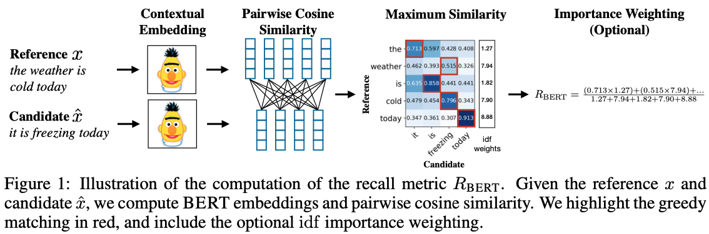

# Textcomparison

Calculate different metrics to compare two texts.

Available at <a href="http://textcomparison.pythonanywhere.com" target="_blank">textcomparison.pythonanywhere.com</a>.

There currently seem to be 4 different approaches to evaluate text similarity. 

These are, in order of increasing abstraction:

1. Character-based metrics (such as the Levenshtein distance)
2. Word-based metrics (such as the BLEU score)
3. Embedding-based metrics (such as BERTScore)
4. LLM-based metrics (such as LLM-as-a-judge)

## Levenshtein distance

This is a character-based metric. It counts the minimum number of characters that need to be deleted, added, or modified to go from one text to another. See [Levenshtein distance](https://en.wikipedia.org/wiki/Levenshtein_distance) on Wikipedia. We use the implementation of the [NLTK](https://www.nltk.org) library, [edit_distance](https://www.nltk.org/api/nltk.metrics.distance.html#nltk.metrics.distance.edit_distance).

## BLEU

BLEU is a text-similarity metric acting on words (separated by whitespace). The metric was shown to correlate with human judgment on text similarity when texts are expressed in a slightly different way (for example by using slightly different words). It may however not correctly pick up changes in meaning that rely on single words, such as the change in causation introduced by changing the single word "because" by "hence". 

We use the implementation of NLTK, [bleu](https://www.nltk.org/api/nltk.translate.bleu), with default settings (up to 4 successive words are taken into account). The reference paper is very readable and is available [here](https://www.aclweb.org/anthology/P02-1040.pdf).

## BERTScore

BERTScore compares the two texts by spliting them into tokens and comparing them using an embedding models. This approach is robust to differences in choice of words or style of writing that do not impact the meaning.

The approach is best described using the illustration from the original paper https://arxiv.org/abs/1904.09675:

For the online tool, we use a small model that fits in the available memory/disk space (t5-small), and we do not use the optionally available rescaling by inverse document frequency scores that may be helpful for more specialized texts.

## LLM-as-a-judge

Finally, we can ask a language model to compare two texts. 

This approach was popularized as 'LLM as a judge' ([paper](https://arxiv.org/pdf/2306.05685)).

An [example of a prompt](https://github.com/lm-sys/FastChat/blob/main/fastchat/llm_judge/data/judge_prompts.jsonl) from the LLM as a judge paper (for judging the quality of an answer to a question):

> Please act as an impartial judge and evaluate the quality of the response provided by an AI assistant to the user question displayed below. Your evaluation should consider factors such as the helpfulness, relevance, accuracy, depth, creativity, and level of detail of the response. Begin your evaluation by providing a short explanation. Be as objective as possible. After providing your explanation, you must rate the response on a scale of 1 to 10 by strictly following this format: \"[[rating]]\", for example: \"Rating: [[5]]\".

The results depend on the instructions given to the model. For example, one could ask the model allow for different choice of words, but to respect the meaning of the texts.

## Setup/Installation

The app can be run locally with `flask --app app run` (executed in a terminal in the directory with the file `app.py`). Then the web interface can be accessed at http://127.0.0.1:5000 

Running the app for the first time will attempt to download the T5 model from huggingface. For this you need to uncomment the line

> os.environ["TRANSFORMERS_OFFLINE"] = "1"

from `app.py`. This will enable the download and place the T5 model in the folder `/static` for future caching.

Instead of running the web app yourself, you can access it at <a href="http://textcomparison.pythonanywhere.com" target="_blank">textcomparison.pythonanywhere.com</a>.